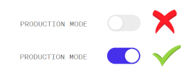
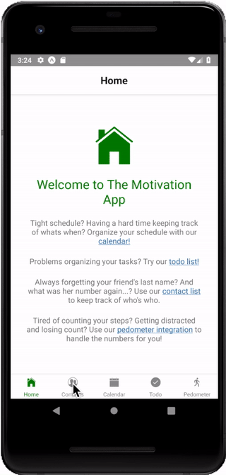
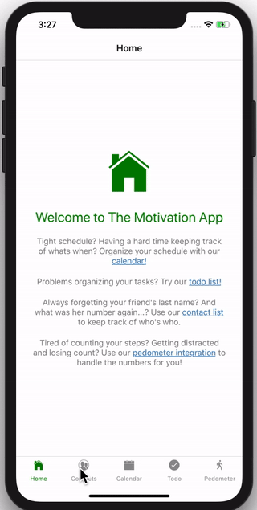
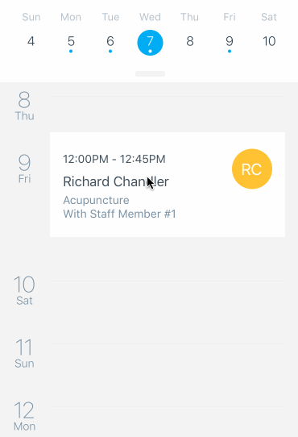

# Dokumentasjon av prosjekt 3 - Webutvikling

## Installering 
For å installere avhengigheter og for å starte serveren til programmet, så navigerer du til prosjektmappa
og kjører disse kommandoene i terminalen din:
```
npm install
expo start
```
Da vil du få opp en QR-code som du scanner i Expo-appen på din telefon som vil bygge prosjektet.

**NB! Huk av 'Production mode' i vinduet som åpnes i nettleseren for best mulig opplevelse av appen.**



## Diskusjon

### Beskrivelse av appen

Vi har laget en applikasjon med fire ulike features: **Kontaktliste**, **Kalender**, **Todoliste** og **Skritteller**.

Android        | iOS
:-------------------------:|:-------------------------:
 | 


I kontaktlista er det muligheter for å se, legge til og slette kontakter med navn og telefonnummer.  
I kalenderen kan man se, legge til, endre og slette avtaler på ulike datoer.  
I todolista kan man se, legge til, slette og fullføre gjøremål.  
I skrittelleren kan man se hvor mange skritt man har gått og hvor langt på vei til 10000 steg man har fullført. 

#### Struktur 

Her følger en beskrivelse av strukturen i prosjektet vårt med de sentrale filene:

- App - rotelementet
  - `App.js` inneholder navigasjonsstrukturen for appen. Se seksjonen "Tutorials" under for en beskrivelse av React Navigation, som er biblioteket vi brukte for navigasjon.
- Contacts
  - `ContactsScreen.js` er hovedkomponenten og inneholder metodene for å hente, lagre og slette kontakter samt å oppdatere state. 
  - `AddContactScreen.js` er komponenten man kommer til ved å trykke på 'Add Contact' i hovedkomponenten. Her blir man møtt med to tekstinputs for navn og nummer, og en knapp for å legge til kontakten. 
  - `EditContactScreen.js` er komponenten man kommer til ved å trykke på en eksisterende kontakt slik at man kan slette den ved å trykke på 'Delete'
  - `ContactPersistence.js` er en innkapsling av AsyncStorage.
- Calendar
  - `CalendarScreen.js` er hovedkomponenten og innholder Agenda-komponenten fra React Native Calendar-biblioteket.
  - `AddAgendaScreen.js` er komponenten man kommer til ved å trykke på 'Create event' på en dato, og her får man opp to tekstinputs hvor man kan legge til en overskrift og en beskrivelse.
  - `EditAgendaScreen.js` er komponenten man kommer til ved å trykke på en eksisterende avtale og her får man muligheten til å endre overskriften og beskrivelsen, samt slette avtalen.
  - `AgendaPersistence.js` inneholder klassen som håndterer lagring til og henting fra AsyncStorage.
- Todo
  - `TodoScreen.js` er hovedkomponenten og inneholder metoder for å legge til, slette, fullføre og redigere oppgaver.
  - `SortedList.js` er en komponent som sorterer de ulike oppgavene slik at de fullførte oppgavene er i bunnen av lista og de oppgavene som fortsatt gjenstår å fullføres er i topp.
  - `TodoItem.js` er en komponent som er de ulike oppgavene i lista, og inneholder selve oppgaveteksten, muligheten for å fullføre en oppgave, samt muligheten til å slette selve oppgaven.
  - `Util.js` er en komponent som inneholder en metode for å holde styr på unike nøkler til oppgavene.
  - `CustomProgressBar.js` er en komponent som inneholder ProgressBar-komponenten fra  React Native Progress-bibliotektet med litt custom tilpasninger som farge og en metode for å hente inn progress.
  - `TaskPersistence.js` er komponenten som håndterer lagring til og henting fra AsyncStorage.
- Pedometer
  - `PedomenterScreen.js` er hovedkomponenten og inneholder funksjonalitet for å hente skritt og vise dem til brukeren
  - `CustomProgressCircle` er en komponent som inneholder ProgressCircle-komponenten fra React Native Progress-bibliotektet med litt tilpassede innstillinger som tekst og fargeendring etter hvor langt i prosessen man har kommet.

#### Testfiler

Vi har valgt å plassere testfiler (filene som slutter med *.test.js) i samme mappe som filen/klassen som testet. Det finnes ulike konvensjoner for dette. Noen foretrekker å plassere testfiler i undermapper kalt `__tests__` (som Jest også automatisk plukker opp), noe som også ville vært en fin løsning. Ved å plassere de i samme mappe forsterker vi idéen om at kildekode og tilhørende testkode har sterk tilknytning - endrer du på kildekoden må testkoden oppdateres. Og ved å studere testene kan man forstå hva koden er ment å gjøre (tester er dokumentasjon).

### Bruk av biblioteker
Vi har brukt en del biblioteker: React Native Calendars, React Native Navigation,
React Native Progress, React Native Vector Icons, React Native og randomColor. 

Vi brukte React Native Progress fordi vi trengte en visualisering av hvor langt vi hadde kommet
i prosessen med for eksempel todo-oppgavene og prosessen mot 10000 steg i pedometeret vårt. Etter
ett kjapt google-søk, så fant vi RNP og fant ut at det var akkurat det vi trengte, og at det dekket
begge behovene på en enkel måte. 

Vi brukte randomColor til å legge til et ekstra lag med farge og dynamikk i applikasjonen. RandomColor 
er et enkelt bibliotek å bruke, hvor man gir en fargegruppe og en ønsket lyshet, og får en tilfeldig farge
i retur. Dette tok vi i bruk i både kontaktlista og 'Todo'-lista vår. 

#### React Navigation

Vi utforsket forskjellige alternativer for navigasjonssystem. Dette er noe man kan lage selv ved å ha React-komponenter som lagrer hvor brukeren er, og bruk av betinget visning basert på state. Dette er fint mulig å utvikle i React fra bunnen av, men ville kreve betydelig arbeid og alle komponenter for navigasjon (slik som faner, stacks, mm.) ville måtte utvikles og testes fra bunnen av. I stedet valgte vi å bruke en pakke som håndterer dette for oss: React Navigation.

Når man bruker kontaktlista og kalenderen er man innom flere forskjellige skjermer. F.eks. når man ønsker å legge til en kontakt, så bruker vi React Navigation til å navigere brukeren til en ny skjerm hvor dette kan gjøres. React Navigation tilbyr flere viktige elementer som forenkler denne prosessen. Disse diskuteres nærmere i guiden i neste seksjon.

## Tutorials

I denne seksjonen forklarer vi hvordan man bruker de mer komplekse bibliotekene vi har tatt i bruk og nå er blitt kjente med. Vi har lært mye om flere biblioteker i løpet av prosjektet og har derfor valgt å lage flere guider, selv om minimumskravet til dokumentasjonen var én guide.

### React Navigation

Som nevnt over har vi brukt pakken React Navigation til å håndtere navigasjonstilstand. Her følger en guide for installasjon og bruk av React Navigation.


#### Installasjon av React Navigation
React Navigation installeres ved kommandoen

```
$ npm install --save react-navigation
```

Etter installasjonen kan (blant annet) funksjonene `createBottomTabNavigator` og `createStackNavigator` importeres med ES6-syntaksen

```js
import { createBottomTabNavigator, createStackNavigator} from "react-navigation";
```
#### createStackNavigator

For å navigere har vi laget forskjellige stack navigators med `createStackNavigator`. For de som er kjent med datastrukturen "stack" vil navnet fortelle mye av hvordan StackNavigator fungerer. Når man navigerer til en side innen en Stack Navigator vil forrige side bli dyttet inn i stakklisten. Når brukeren ønsker å dra tilbake (vha. tilbaketasten, tilbakepila ol.) blir forrige side poppet fra stakken. Stack Navigator vil med andre ord alltid huske veien du brukte til en side.

Se eksempel for ContactsStack fra appen:
```js
const ContactsStack = createStackNavigator({
  Contacts: ContactsScreen,
  AddContact: AddContactScreen,
  EditContact: EditContactScreen
});
```
ContactsStack er en stack som består av 3 forskjellige sider som det nå er mulig å navigere mellom vha:

```js
this.props.navigation.navigate("ScreenName", {props});
```
React Navigation gjør det mulig å sende med funksjoner og elementer som props når man navigerer, noe som gjør det lettere for de forskjellige skjermene å samhandle.

Stack navigator tilbyr også animasjoner, en header med tilbakeknapp ved default, og håndterer navigasjonshistorikken slik at man kan navigere seg tilbake til forrige aktive skjerm.

#### createBottomTabNavigator

`createBottomTabNavigator` er en enkel måte å opprette en fanemeny (tab-bar) som lar en bytte mellom forskjellige faner. De forskjellige skjermene vil ikke mounte før første tilnavigering.

Ved å kombinere Stack Navigators som nevnt over med tab-bar kan man få både historikk samt en oversiktlig meny i bunnen

```js
const RootBottomTabNavigator = createBottomTabNavigator({
  Home: HomeStack,
  Contacts: ContactsStack
});
```

Legg merke til at tab-baren som opprettes her (RootBottomTabNavigator) består av Navigation Stacks, som igjen består av flere ulike skjermer/komponenter. Kombinasjon av ulike navigasjonskomponenter er et kraftig verktøy for å tilpasse navigeringen i mobilapper.

Vi håper denne korte introduksjonen til React Navigation ga mersmak og illustrerte hvordan man kan bygge opp en navigasjonsstruktur. Se [dokumentasjonen til React Navigation](https://reactnavigation.org/docs/en/getting-started.html) for en grundigere gjennomgang av hvordan dette biblioteket fungerer.

### React Native Progress 
Vi brukte [React Native Progress](https://github.com/oblador/react-native-progress), som er et bibliotek som implementerer prosessindikatorer i form av 
sirkler og barer. De var veldig intuitive å bruke, og tar egentlig bare inn `progress` som prop, som er 
et tall mellom 0 og 1, hvor 0 er ingen progress og 1 er ferdig. 

#### Installasjon av React Native Progress

RNP kan installeres ved hjelp av npm og kommandoen
```
npm install react-native-progress --save
```

Etter installasjon kan man importere de ulike progress-komponentene ved bruk av ES6-syntax:

```js 
import ProgressBar from 'react-native-progress/Bar';
``` 
for progress-baren brukt i 'Todo'-lista vår, og 
```js
import ProgressCircle from 'react-native-progress/Circle';
```
for sirkelen brukt i 'Pedometeret' vårt.

#### Bruk av React Native Progress

Man kan bruke RNP på ulike måter, både baren og sirkelen kan bruke som laste-indikatorer ved å sette `indeterminate`-propen til `true`. Ellers vil
man kunne bruke de slik vi har gjort, ved å gi de en verdi mellom 0 og 1 for å angi progresjon. 

Da bruker man komponentene direkte på denne måten. 
```js 
<ProgressBar progress={0.5}/>
<ProgressCircle progress={0.5} size={50}/>
```
Det finnes også en mengde andre props som `color`, `borderWidth`, `thickness` osv...


### React Native Calendars 

Vi valgte å bruke pakken [React Native Calendars](https://github.com/wix/react-native-calendars) for å vise en kalender til brukeren. React Native Calendar, eller RNC på kortform, kan brukes til noe så enkelt som å la brukeren velge en dato, eller noe mer innfløkt som en tidsplanlegger.

Til vårt formål brukte vi bare "Agenda"-komponenten. Her følger en kjapp guide for å få React Native Calendar opp og kjøre i ditt React Native prosjekt.




#### Installasjon av RNC
RNC installeres ved kommandoen

```
$ npm install --save react-native-calendars
```

Etter installasjonen kan komponentene `Calendar`, `CalendarList` og `Agenda` importeres med ES6-syntaksen

```js
import { Calendar, CalendarList, Agenda } from "react-native-calendars"
```

Disse kan brukes direkte via JSX i render-funksjonen i dine React-komponenter. Merk: Vi hadde problemer med å få `Agenda` til å vises på korrekt måte. Det viser seg at man må legge til en minimumshøyde for å få det til å vises korrekt: `<Agenda style={{minHeight: 200}} />`

#### Visning av elementer på kalenderen

RNC kan vise elementer via `items`-egenskapen. Dette objektet er en map / dictionary fra en dato (av type streng) til en liste av elementer. Se eksempel:

```js
render() {
    const items = {
      "2018-05-12": [{text: "Et element"}],
      "2018-05-13": [{text: "Enda ett element"}, {text: "2 på en dag!"}],
      "2018-05-14": []
    };
    return (
      <Agenda
          ...
          items={items}
          ...
      />);
}
```

(OBS: Her brukes tre prikker til å indikere andre egenskaper på Agenda, ikke ES6 spread syntaksen)

Hvordan disse vises på kalenderen må du definere selv. Egenskapen `renderItem` på `Agenda` definerer en funksjon som tar inn et element og returnerer et visbart React-element (F.eks. et JSX-uttrykk). Her er et eksempel på en passende funksjon:

```js
<Agenda
    ...
    renderItem={(item) => {return <Text>{item.text}</Text>;}}
    ...
/>
```

#### Dynamisk innlasting av data

RNC sier selv i fra når det passer å laste inn mer data. Du kan dermed dynamisk laste inn data når det er behov, f.eks. fra en ekstern web-tjeneste, eller fra AsyncStorage. "callback" for dynamisk lasting gis via egenskapen `loadItemsForMonth`, som argument tar den inn en dato for startdagen i måneden. Det er ikke meningen at den skal returnere noe, vanligvis lagres data på state, og et kall på `loadItemsForMonth` indikerer at du bør utvide datasettet med de dagene i måneden input-argumentet tilhører.

Her er et eksempel på en implementasjon av `loadItemsForMonth`:

```js
loadItems = (dayInMonth) => {
  MyAwesomeAsyncDataFetcher.fetchFullMonthByDay(dayInMonth)
    .then(data => {
      this.setState(prevState => {
        return {items: Object.assign({}, prevState.items, data)};
      });
    });
};
render() {
  return (<Agenda
    ...
    items={this.state.items}
    loadItemsForMonth={this.loadItems}
    ...
  />);
}
```

I eksemplet over later jeg som `MyAwesomeAsyncDataFetcher` er en selvimplementert modul som asynkront henter inn data fra et ekstert endepunkt.

Merk at alle datoene for en måned må finnes som nøkler i `items`-objektet. Dersom en dato ikke er ment å ha noen elementer kan du bruke en tom liste som verdi. Mangel på nøkkel for en dato tolkes som at måneden ikke er ferdig lastet inn ennå.

Vi håper denne korte guiden var hjelpsom for å sette opp React Native Calendars. Bruk gjerne den offisielle [dokumentasjonen](https://github.com/wix/react-native-calendars#usage) til RNC for å få en oversikt over alle mulighetene i RNC, og se vår klasse "CalendarScreen" for hvordan Agenda kan brukes i en React Native app.

## Testing

> Developer testing is an important step towards accountability. It gives developers a way to demonstrate the quality of the software they produce.
- Kent Beck

I dette prosjektet har vi benyttet oss av flere former for testing. Til enhetstesting og "snapshot"-testing har vi brukt Javascript-biblioteket [Jest](https://jestjs.io/). Der Jest ikke har strukket til har vi benyttet oss av manuell end-to-end testing.

### Automatisert testing

Vi ønsket opprinnelig å bruke [Enzyme](https://github.com/airbnb/enzyme) til å programetisk traversere og manipulere React Native-applikasjonen. Dessverre hadde vi flere problemer med å integrere det med Expo, og mye tydet på at Enzyme ikke var kompitabelt med siste versjon av React Native. Da kravet til Enzyme ble droppet fjernet vi Enzyme fra prosjektet vårt.

Vi har brukt Jest til å definere testsett og for å skrive tester. Testene kjøres ved å skrive `npm test` i terminalen. Vi hadde vanskeligheter med å starte jest direkte på Windows, så vi definerte et npm-script som bruker node direkte, og som fungere på alle plattformer. Denne kan startes via `npm run testnode`.

Snapshot-testing fungerer ved å representere strukturen til komponentene i tekstform og lagre denne første gang testen kjøres. Senere tas det et nytt "bilde"/snapshot av strukturen, som så sammenlignes med den lagrete strukturen. Slik er det lett å finne ut om kode endrer på visningen til komponentene og så kunne vurdere om endringen er ønskelig eller uønskelig. Vi brukte `react-test-renderer` til å serialisere strukturen til React-komponentene våre, og Jest til å skrive og kjøre testen.

Enhetstesting er å teste kode i isolasjon. Man identifiserer enheter i koden som transformerer data, isolerer koden, mater koden med ulike (gyldige eller ugyldige) inndata og observerer om utdata er slik man forventer. For enhetstesting brukte vi Jest. Vi lagde blant annet en mock av AsyncStorage for å teste om vår API-bruk var korrekt uten å behøve en emulasjon eller drive med manuell testing.

Vi ønsket som sagt å bruke Enzyme til å teste interaksjon i programmet. Simulere tastetrykk blant annet og se om komponentene oppførte seg som forventet. Uten Enzyme var dette utfordrende, og mye måtte testes manuelt.

## Manuell testing

Vi drev med mye manuell testing. Under utviklingen brukte vi Android- og iPhone-enheter til å kjøre koden, og vi fikk dermed benytte appen mye i målmiljøet. Det er ønskelig å minimere manuell testing og automatisere testing der det er mulig, men som nevnt i forrige avsnitt var det utfordrende gitt problemer med Enzyme.

Vi gikk systematisk til verk med manuell testing, og dette knyttet seg naturlig opp mot vår bruk av Pull Requests i GitHub. All kode som går til `master` må gå gjennom Pull Requests, og før en Pull Request kan merges må den gjennomgås av en annen utvikler enn utvikleren som opprettet PR-en. I denne prosessen bygget og kjørte vi koden på vår egen mobil før vi godkjente Pull Requesten. Vi plukket fort opp mindre feil og forglemmelser, blant annet fordi vi har ulike mobiler og ikke alle kunne emulere iPhone. Under vises et eksempel på en end-to-end test av kontaktlista:

1. Slett tidligere data og start appen, naviger til kontaktlista
2. Er kontaktlista tom?
3. Legg til en kontakt.
4. Vises kontakten i lista?
5. Avslutt programmet og start opp på nytt igjen.
6. Vises kontakten fortsatt i lista?
7. Slett kontakten.
8. Er kontakten fjernet fra lista?
9. Avslutt programmet og start opp på nytt igjen.
10. Er kontakten fortsatt fjernet fra lista?

## Testautomatisering

Testautomatisering er å automatisere håndtering av tester og er en sentral del av kontinuerlig integrering. Vi er tilhengere av kontinuerlig testing og vurderte å legge til CI (Continuous Integration) til GitHub via f.eks. CircleCI eller TravisCI. På grunn av at vi hadde mye å lære i dette prosjektet, den relativt korte varigheten av prosjektet, og problemer med Enzyme, valgte vi å ikke sette opp Continual Integration.

## Kort om vår bruk av Github

Oppgaven ble dekomponert til utviklingsoppgaver og hver utviklingsoppgave fikk sin egen issue. Vi fordelte arbeidsoppgaver, og lagde greiner for hver nye utviklingsoppgave ettersom vi jobbet med de (f.eks. `feat_todo`, `dev_tests`). Når en utviklingsoppgave var moden opprettet vi Pull Request mot master. Før en PR blir merget må den godkjennes av minst en annen bidragsgiver, og godkjenningsprosessen innebærte kjøring av tester og test av appen lokalt.

Alle endringer til master ble merget gjennom Pull Requests. Ved å gå til oversikten av commits er det mulig å gå direkte til den PRen som førte til at commit-en ble merget til master.

Mye av kommunikasjonen gikk direkte eller over eksterne kanaler, og arbeidet ble koordinert ved bruk av greiner, pull requests og GitHub issues. Dersom to eller flere jobbet på samme utviklingsoppgave (utenom parprogrammering på en PC) brukte vi flere greiner der det behøvdes slik at arbeidet kunne koordineres uten uforutsette merge conflicts. Som et eksempel: om Per og Kari jobbet med `feat_todo`, kunne de lage `feat_todo_kari` og `feat_todo_per`, og pushe og pulle sine endringer til og fra `feat_todo`, og så opprette en Pull Request for `feat_todo` når utviklingsoppgaven ble ferdig utviklet.

## Bibliotek og kilder

 * [React Native Progress](https://github.com/oblador/react-native-progress)
 * [React Native Vector Icons](https://www.github.com/oblador/react-native-vector-icons)
 * [React Native Calendar](https://github.com/wix/react-native-calendars)
 * [React Navigation](https://reactnavigation.org)
 * [RandomColor](https://www.npmjs.com/package/randomcolor)
 
 
 