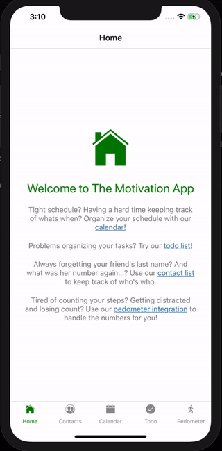

# Dokumentasjon av prosjekt 3 - Webutvikling

## Installering 
For å installere avhengigheter og for å starte serveren til programmet, så navigerer du til prosjektmappa
og kjører disse kommandoene i terminalen din:
```
npm install
expo start
```
Da vil du få opp en QR-code som du scanner i Expo-appen på din telefon som vil bygge prosjektet.

**NB! Huk av 'Production mode' i vinduet som åpnes i nettleseren for best mulig opplevelse av appen.**


## Diskusjon

### Beskrivelse av appen

Vi har laget en applikasjon med fire ulike features: **Kontaktliste**, **Kalender**, **Todoliste** og **Skritteller**.



I kontaktlista er det muligheter for å se, legge til og slette kontakter med navn og telefonnummer.  
I kalenderen kan man se, legge til, endre og slette avtaler på ulike datoer.  
I todolista kan man se, legge til, slette og fullføre gjøremål.  
I skrittelleren kan man se hvor mange skritt man har gått og hvor langt på vei til 10000 steg man har fullført. 

#### Struktur 

Her følger en beskrivelse av strukturen i prosjektet vårt med de sentrale filene:

- App - rotelementet
  - `App.js` inneholder navigasjonsstrukturen for appen. Se seksjon under for en beskrivelse av React Navigation, som er biblioteket vi brukte for navigasjon.
- Contacts
  - `ContactsScreen.js` er hovedkomponenten og inneholder metodene for å hente, lagre og slette kontakter samt og oppdatere state. 
  - `AddContactScreen.js` er komponenten man kommer til ved å trykke på 'Add Contact' i hovedkomponenten. Her blir man møtt med to tekstinputs for navn og nummer, og en knapp for å legge til kontakten. 
  - `EditContactScreen.js` er komponenten man kommer til ved å trykke på en eksisterende kontakt slik at man kan slette den ved å trykke på 'Delete'
  - `ContactPersistence.js` er en innkapsling av AsyncStorage.
- Calendar
  - `CalendarScreen.js` er hovedkomponenten og innholder Agenda-komponenten fra React Native Calendar-biblioteket.
  - `AddAgendaScreen.js` er komponenten man kommer til ved å trykke på 'Create event' på en dato, og her får man opp to tekstinputs hvor man kan legge til en overskrift og en beskrivelse.
  - `EditAgendaScreen.js` er komponenten man kommer til ved å trykke på en eksisterende avtale og her får man muligheten til å endre overskriften og beskrivelsen, samt slette avtalen.
  - `AgendaPersistence.js` inneholder klassen som håndterer lagring til og henting fra AsyncStorage.
- Todo
  - `TodoScreen.js` er hovedkomponenten og inneholder metoder for å legge til, slette, fullføre og redigere oppgaver.
  - `SortedList.js` er en komponent som sorterer de ulike oppgavene slik at de fullførte oppgavene er i bunnen av lista og de oppgavene som fortsatt gjenstår å fullføres er i topp.
  - `TodoItem.js` er en komponent som er de ulike oppgavene i lista, og inneholder selve oppgaveteksten, muligheten for å fullføre en oppgave, samt muligheten til å slette selve oppgaven.
  - `Util.js` er en komponent som inneholder en metode for å holde styr på unike nøkler til oppgavene.
  - `CustomProgressBar.js` er en komponent som inneholder ProgressBar-komponenten fra  React Native Progress-bibliotektet med litt custom tilpasninger som farge og en metode for å hente inn progress.
  - `TaskPersistence.js` er komponenten som håndterer lagring til og henting fra AsyncStorage.
- Pedometer
  - `PedomenterScreen.js` er hovedkomponenten og inneholder funksjonalitet for å hente skritt og vise dem til brukeren
  - `CustomProgressCircle` er en komponent som inneholder ProgressCircle-komponenten fra React Native Progress-bibliotektet med litt tilpassede innstillinger som tekst og fargeendring etter hvor langt i prosessen man har kommet.

#### Testfiler

Vi har valgt å plassere testfiler (filene som slutter med *.test.js) i samme mappe som filen/klassen som testet. Det finnes ulike konvensjoner for dette. Noen foretrekker å plassere testfiler i undermapper kalt `__tests__` (som Jest også automatisk plukker opp), noe som også ville vært en fin løsning. Ved å plassere de i samme mappe forsterker vi idéen om at kildekode og tilhørende testkode har sterk tilknytning - endrer du på kildekoden må testkoden oppdateres. Og ved å studere testene kan man forstå hva koden er ment å gjøre (tester er dokumentasjon).

### Bruk av biblioteker
Vi har brukt en del biblioteker: React Native Calendars, React Native Navigation,
React Native Progress, React Native Vector Icons, React Native og randomColor. 

Vi brukte React Native Progress fordi vi trengte en visualisering av hvor langt vi hadde kommet
i prosessen med for eksempel todo-oppgavene og prosessen mot 10000 steg i pedometeret vårt. Etter
ett kjapt google-søk, så fant vi RNP og fant ut at det var akkurat det vi trengte, og at det dekket
begge behovene på en enkel måte. 

Vi brukte randomColor bare for å legge til et ekstra lag med farge og dynamikk i applikasjonen. RandomColor 
er et enkelt bibliotek å bruke, hvor man gir en fargegruppe og en ønsket lyshet, og får en tilfeldig farge
i retur. Dette tok vi i bruk i både kontaktlista og 'Todo'-lista vår. 

**React Navigation**

Vi utforsket forskjellige alternativer for navigasjonssystem, og valgte å bruke en pakke som håndterer state for oss og gir mange ulike navigasjonskomponenter som vi ellers hadde måtte utvikle for hånd: React Navigation.
React Navigation tilbyr flere viktige elementer som ikke er innebygd i React Native som å navigere mellom forksjellige sider av appen på, og håndtere navigasjonshistorikken.

Når man bruker kontaktlista og kalenderen er man innom flere forskjellige skjermen. F.eks når man ønsker å legge til en kontakt, så bruker vi React Navigation til å navigere brukeren til en ny skjerm hvor dette kan gjøres.

Headeren er et element som er inkludert automatisk av Stack Navigator. I headeren er det en "tilbake"-knapp som vil føre brukeren tilbake til forrige aktive side. Siden dette er inkludert automatisk er det mye enklere enn om vi skulle ha måtte utviklet dette selv.

React Navigation legger til og fjerner ting fra navigation stacken mens brukerer navigerer seg rundt. Den tilbyr animasjoner og overganger.  En annen stor grunn til at vi valge å pakken React Navigation er for implementering av tab-baren, noe som React Navigation forenkler vha `createBottomTabNavigator`.


### Tutorials

#### React Navigation
Vi har brukt biblioteket React Navigation, noe vi velger å bruke siden det tilbyr flere viktige elementer som ikke er innebygd i React Native, som å navigere mellom forksjellige sider i appen, og håndtere navigasjonshistorikken, samt implementering av tab-bar.


##### Installasjon av React Navigation
React Navgation installeres ved kommandoen

```
$ npm install --save react-navigation
```

Etter installasjonen kan komponentene `createBottomTabNavigator` og `createStackNavigator` importeres med ES6-syntaksen

```js
import { createBottomTabNavigator, createStackNavigator} from "react-navigation"}
```
##### createStackNavigator
For å bruke navigeringen har vi laget forskjellige stack navigators med `createStackNavigator`. En stack kan inneholde flere forskjellige sider, og vil gjøre det mulig å navigere mellom disse sidene.
createStackNavigator tilbyr en måte for appen å navigere mellom forskjellige skjermer på, hvor hver skjerm blir plassert på toppen av en stack.

Se eksempel for ContactsStack fra appen:
```js
const ContactsStack = createStackNavigator({
  Contacts: ContactsScreen,
  AddContact: AddContactScreen,
  EditContact: EditContactScreen
});
```
ContactsStack er en stack som består av 3 forksjellige sider som det nå er mulig å navigere mellom vha:

```js
this.props.navigation.navigate("ScreenName", {props})
```
React Navigation gjør det mulig å sende med funksjoner og elementer som props når man navigerer, noe som gjør det lettere for de forskjellige skjermene å samhandle.
Stack navigator tilbyr også animasjoner, og en header med tilbakeknapp ved default, og håndterer navigasjonshistorikken slik at man kan navigere seg tilbake til forrige aktive skjerm.

KANSKJE EN GIF AV HVORDAN MAN NAVIGERER HER

##### createBottomTabNavigator
En simpel måte å opprette en tab-bar på bunnen av skjermen på, som lar en bytte mellom forskjellige routes. De forskjellige skjermene vil ikke mounte før første tilnavigering.
Vi har brukt `createBottomTabNavigator`til å lage tab-baren som navigerer brukeren til de forskjellige funksjonene i appen.

Ved å bruke Stack Navigators lagt med `createStackNavigator`som nevnt over, brukte vi den innebygde måten i React Navigation til å lage en Tab-Bar i bunnen, som man manuelt kan endre og tilpasse gjennom `navigationOptions`.

```js
const RootBottomTabNavigator = createBottomTabNavigator({
  Home: {
    screen: HomeStack,
	navigationOptions: {
      tabBarLabel: 'Home',
	  }
  },
  Contacts: {
    screen: ContactsStack,
    navigationOptions: {
      tabBarLabel: 'Contacts',
    }
  }
}
```


#### React Native Progress 
Vi brukte [React Native Progress](https://github.com/oblador/react-native-progress), som er et bibliotek som implementerer prosessindikatorer i form av 
sirkler og barer. De var veldig intuitive å bruke, og tar egentlig bare inn `progress` som prop, som er 
et tall mellom 0 og 1, hvor 0 er ingen progress og 1 er ferdig. 

##### Installasjon av React Native Progress

RNP kan installeres ved hjelp av npm og kommandoen
```
npm install react-native-progress --save
```

Etter installasjon kan man importere de ulike progress-komponentene ved bruk av ES6-syntax:

```js 
import ProgressBar from 'react-native-progress/Bar';
``` 
for progress-baren brukt i 'Todo'-lista vår, og 
```js
import ProgressCircle from 'react-native-progress/Circle';
```
for sirkelen brukt i 'Pedometeret' vårt.

##### Bruk av React Native Progress

Man kan bruke RNP på ulike måter, både baren og sirkelen kan bruke som laste-indikatorer ved å sette `indeterminate`-propen til `true`. Ellers vil
man kunne bruke de slik vi har gjort, ved å gi de en verdi mellom 0 og 1 for å angi progresjon. 

Da bruker man komponentene direkte på denne måten. 
```js 
<ProgressBar progress={0.5}/>
<ProgressCircle progress={0.5} size={50}/>
```
Det finnes også en mengde andre props som `color`, `borderWidth`, `thickness` osv...


#### React Native Calendars 

Vi valgte å bruke pakken [React Native Calendars](https://github.com/wix/react-native-calendars) for å vise en kalender til brukeren. React Native Calendar, eller RNC på kortform, kan brukes til noe så enkelt som å la brukeren velge en dato, eller noe mer innfløkt som en tidsplanlegger.

Til vårt formål brukte vi bare "Agenda"-komponenten. Her følger en kjapp guide for å få React Native Calendar opp og kjøre i ditt React Native prosjekt.


##### Installasjon av RNC
RNC installeres ved kommandoen

```
$ npm install --save react-native-calendars
```

Etter installasjonen kan komponentene `Calendar`, `CalendarList` og `Agenda` importeres med ES6-syntaksen

```js
import { Calendar, CalendarList, Agenda } from "react-native-calendars"
```

Disse kan brukes direkte via JSX i render-funksjonen i dine React-komponenter. Merk: Vi hadde problemer med å få `Agenda` til å vises på korrekt måte. Det viser seg at man må legge til en minimumshøyde for å få det til å vises korrekt: `<Agenda style={{minHeight: 200}} />`

##### Visning av elementer på kalenderen

RNC kan vise elementer via `items`-egenskapen. Dette objektet er en map / dictionary fra en dato (av type streng) til en liste av elementer. Se eksempel:

```js
render() {
    const items = {
      "2018-05-12": [{text: "Et element"}],
      "2018-05-13": [{text: "Enda ett element"}, {text: "2 på en dag!"}],
      "2018-05-14": []
    };
    return (
      <Agenda
          ...
          items={items}
          ...
      />);
}
```

(OBS: Her brukes tre prikker til å indikere andre egenskaper på Agenda, ikke ES6 spread syntaksen)

Hvordan disse vises på kalenderen må du definere selv. Egenskapen `renderItem` på `Agenda` definerer en funksjon som tar inn et element og returnerer et visbart React-element (F.eks. et JSX-uttrykk). Her er et eksempel på en passende funksjon:

```js
<Agenda
    ...
    renderItem={(item) => {return <View>{item.text}</View>;}}
    ...
/>
```

##### Dynamisk innlasting av data

RNC sier selv i fra når det passer å laste inn mer data. Du kan dermed dynamisk laste inn data når det er behov, f.eks. fra en ekstern web-tjeneste, eller fra AsyncStorage. "callback" for dynamisk lasting gis via egenskapen `loadItemsForMonth`, som argument tar den inn en dato for startdagen i måneden. Det er ikke meningen at den skal returnere noe, vanligvis lagres data på state, og et kall på `loadItemsForMonth` indikerer at du bør utvide datasettet med de dagene i måneden input-argumentet tilhører.

Her er et eksempel på en implentasjon av `loadItemsForMonth`:

```js
loadItems = (dayInMonth) => {
  MyAwesomeAsyncDataFetcher.fetchFullMonthByDay(dayInMonth)
    .then(data => {
      this.setState(prevState => {
        return {items: Object.assign({}, prevState.items, data)};
      });
    });
};
render() {
  return (<Agenda
    ...
    items={this.state.items}
    loadItemsForMonth={this.loadItems}
    ...
  />);
}
```

I eksemplet over later jeg som `MyAwesomeAsyncDataFetcher` er en selvimplementert modul som asynkront henter inn data fra et ekstert endepunkt.

Merk at alle datoene for en måned må finnes som nøkler i `items`-objektet. Dersom en dato ikke er ment å ha noen elementer kan du bruke en tom liste som verdi. Mangel på nøkkel for en dato tolkes som at måneden ikke er ferdig lastet inn ennå.

Vi håper denne korte guiden var hjelpsom for å sette opp React Native Calendars. Bruk gjerne den offisielle [dokumentasjonen](https://github.com/wix/react-native-calendars#usage) til RNC for å få en oversikt over alle mulighetene i RNC, og se vår klasse "CalendarScreen" for hvordan Agenda kan brukes i en React Native app.

#### Jest (?)
